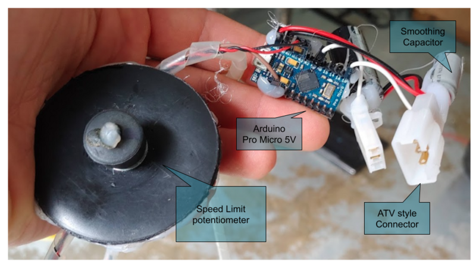

Arduino Throttle Correction for 3-wire thottles
----

### Purpose

This project is suitable for electric vehicles with a non-programmable controller. 
The arduino is inserted between a 3-wire throttle and the controller.

* Provides smoothing for aggressive throttle response by slowing down changes in output (wheelie/jerk control)
* Reduces throttle dead-band by mapping input to output values as per configuration
* Optionally provides an adjustable speed limit (hardcoded or potentiometer/switch)

### Wiring and Implementation

Wiring is very simple.  Smoothing capacitor can be any value that eliminates
jumping of motor speed at steady throttle.  I believe that I used a 100uF for my setup.  
A high value may cause the throttle to stay high longer than desired. 

Note that I added a power supply capacitor as well, but it was probably unnecessary.

### Tuning

Tune behaviors according to your throttle's actual values, which you can see if you watch serial output.

If you don't want speed limiting, comment out `#LIMIT_ENABLE`

**Note** that when plugged into USB, Arduino is running at 5V, but when powered by the motor controller,
it is most likely running on 4.0V-4.5V.  This changes the numbers and behavior a little when you unplug USB.
My Arduino clone (Pro Micro 5 volt) works fine at this voltage, your mileage may vary.

### Story

This implementation came into being after I tried [a variety of circuits](https://electricbike.com/forum/forum/kits/golden-motor-magic-pie/70584-guide-to-hall-sensor-throttle-operation-testing-and-modification/) to achieve my goals.
I was setting up a mini-ATV (110cc size) as an electric garden cart tractor.
It is powered by a Vevor 2KW motor and their bundled controller and 1:20 gearing.  
With that amount of torque, the ATV was popping wheelies with the slightest twist of the throttle. 
I also wanted a speed limit for delicate maneuvering in the garden.